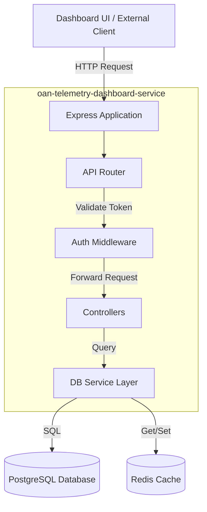

# oan-telemetry-dashboard-service Technical Documentation

## 1. System Overview

**oan-telemetry-dashboard-service** (internally "telemetry-query-service") is a backend microservice built with **Node.js** and **Express**. It serves as the data retrieval layer for the Telemetry Dashboard, providing APIs to query user interactions, session details, feedback, and system errors. It connects to a **PostgreSQL** database for persistent storage and **Redis** for caching or session management.

### Primary Objective
To expose secure, performant REST APIs that aggregators and administrators use to visualize system usage, debug errors, and analyze user engagement metrics.

---

## 2. Architecture & Design

The service follows a standard **Layered Architecture** typical of Express.js applications.

### Design Patterns
-   **MVC (Model-View-Controller)**: Although "Views" are JSON responses, the Controller-Service-Model separation is evident.
-   **Middleware Chain**: Uses middleware for cross-cutting concerns like Authentication (`auth.controller.js`), Logging (`morgan`), and CORS.
-   **Singleton Database Pool**: Database connections are managed via a shared pool (`services/db`).

### Architecture Diagram



### Data Flow
1.  **Request Entry**: Requests enter via `index.js`.
2.  **Middleware**: `cors` headers are applied, and `morgan` logs the request. Requests to protected routes (`/v1/...`) pass through `authController` or `leaderboardAuthController`.
3.  **Routing**: `index.js` delegates to specific route modules (e.g., `questionRoutes`, `userRoutes`).
4.  **Processing**: Controllers execute business logic, often parsing query parameters for filtering (StartDate, EndDate, Search).
5.  **Data Access**: The service queries PostgreSQL using the `pg` library.
6.  **Response**: JSON data is formatted and sent back to the client.

---

## 3. Module/Component Breakdown

### Core Directories
-   `routes/`: Defines API endpoints and maps them to controller functions.
-   `controllers/`: Contains the business logic for handling requests.
-   `services/`: Shared services, primarily Database connection (`db.js`).
-   `middleware/`: Custom middleware functions.

### Key Components

| Component / File | Responsibility | Interactions |
| :--- | :--- | :--- |
| **`index.js`** | Application Entry Point. Configures Express, Middleware, and Routes. | Initializes server, connects routes, manages shutdown. |
| **`controllers/auth.controller.js`** | Authentication Middleware. | Verifies JWT tokens (likely via `jose` or `jsonwebtoken`) before allowing access. |
| **`services/db.js`** | Database Connection Pool. | Exports a query interface used by all controllers to access PostgreSQL. |
| **`routes/questionRoutes.js`** | Routes for Question data. | Maps `/questions` endpoints to `questions.controller.js`. |
| **`routes/dashboard.Routes.js`** | Aggregated dashboard metrics. | Provides high-level stats for the dashboard home screen. |

---

## 4. Key Logic & Algorithms

### Authentication & Authorization
The service seems to implement two distinct auth flows:
1.  **General API Auth**: Handled by `auth.controller.js` for standard dashboard access.
2.  **Leaderboard Auth**: Handled by `leaderboardAuth.controller.js`, likely for public or specific leaderboard access.
*The logic typically involves parsing the `Authorization` header, validating the Bearer token, and attaching user context to `req.user`.*

### Filtering & Pagination Logic
Most "Get All" endpoints (Users, Questions, Sessions) implement a standardized filtering pattern:
1.  **Pagination**: Accepts `page` and `limit`. Calculates `OFFSET` and `LIMIT` for SQL queries.
2.  **Date Range**: Accepts `startDate` and `endDate`. Appends calls to `WHERE created_at BETWEEN $1 AND $2`.
3.  **Search**: accepts `search` string. Appends `WHERE column ILIKE %search%`.

---

## 5. API/Interface Reference

For a detailed breakdown of every endpoint, please refer to the [API_DOCUMENTATION.md](./API_DOCUMENTATION.md) file in this repository.

### Summary of Resources
*   **`/v1/questions`**: Query user questions and bot responses.
*   **`/v1/users`**: Manage and view user statistics.
*   **`/v1/sessions`**: View interaction sessions.
*   **`/v1/feedback`**: Retrieve user feedback on answers.
*   **`/v1/dashboard`**: Aggregate metrics (Total Users, Total Questions, etc.).
*   **`/v1/leaderboard`**: Gamification metrics.
*   **`/v1/api/villages`**: Village-level geographical data.

---

## 6. Dependencies

| Library | Purpose |
| :--- | :--- |
| **express** | Web framework. |
| **pg** | PostgreSQL client for Node.js. |
| **ioredis / redis** | Redis clients for caching/sessions. |
| **jose** | JWT signing and verification. |
| **node-cron** | Schedluing background tasks. |
| **morgan** | HTTP request logger. |
| **cors** | Cross-Origin Resource Sharing middleware. |
| **dotenv** | Environment variable management. |

---

## 7. Setup & Usage

### Prerequisites
*   Node.js (v18+)
*   PostgreSQL instance
*   Redis instance

### Installation
1.  Navigate to the directory:
    ```bash
    cd oan-telemetry-dashboard-service
    ```
2.  Install dependencies:
    ```bash
    npm install
    ```

### Configuration
Create a `.env` file based on your environment requirements. Key variables typically include:
-   `PORT`: Server port (default 3000)
-   `DB_HOST`, `DB_USER`, `DB_PASS`, `DB_NAME`: PostgreSQL credentials.
-   `REDIS_URL`: Connection string for Redis.

### Running the Service
*   **Development**:
    ```bash
    npm start
    # or
    nodemon index.js
    ```
*   **Production**:
    ```bash
    node index.js
    ```
